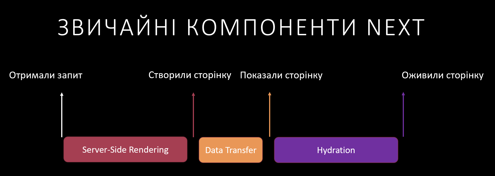

# NextJS та нові серверні компонени - навіщо потрібні та як готувати

Всім привіт, мене звати Віталій Рубан, я працюю в компаніїї Ітера і сьогодні я розкажу про нову, цікаву, але досить неоднозначну можливість, яка з'явилася в останньому оновленні 13.4 Next.JS - серверні компоненти.

## Навіщо з'явилися серверні компоненти?

Давайте почнемо з найважливішого - відповіді на запитання "Навіщо з'явилися серверні компоненти"?

Як ви, напевно вже знаєте, спрощено, Next.JS працює наступним чином:

1. Клієнт звертається за адресою, яку обслуговую Next.JS сервер
2. Next.JS, в рантаймі (можуть бути опитмізації з кешуванням), отримує необхідні для створінки дані
3. І створює HTML сторінку, яку, разом з JS кодом, відправляє клієнтові
4. Оскільки сторінка є звичайним HTML-ем - користувач бачить її по мірі завантаження і, на відміну від SPA, не чекає допоки React створить її з нуля на клієнті
5. Після отримання клієнтського бандлу відбувається процес гідрації - перетворення статичного HTML-у на звичний нам React застосунок, з яким користувач може взаємодіяти. Якщо гідрацію не робити, користувач просто не зможе взаємодіяти з HTML сторінкою, тому що всі event listner додаються саме на цьому етапі

Весь цей, досить складний процес робиться для того, щоб ваш користувач як найшвидше побачив потрібний йому контент і не пішов передачсно з вашого веб сайту. Це також спрощує життя SEO роботам і збільшує шанси сторінки опинитися вище в пошуку. При цьому, розробник може працювати в звичному і зручному React-і з усіма його перевагами - компонентним підходом, HMR, та багатим інструментарієм.

Але цей процес має недоліки, найбільший з яких полягає в тому, що всі залежності, які ви використовуєте всередині вашого компоненту будуть включені в бандл застосунку, що збільшує час, через який ваш застосунок стане інтерактивним. Можлива навіть така ситуація, коли користувач вже завантажив сторінку, намагається з нею взаємодіяти, але вона не відповідає, оскільки головний потік зайнятий парсінгом JavaScript-а або гідрацією. Це справляє враження що ваша сторінка взагалі не робоча і люди можуть її залишити. Ще й друзям розкажуть, що ваш магазин не працює.

Другий недолік полягає в тому, що в гідрації та в життєвому циклі React застосунку участь приймають всі компоненти, навіть ті, контент яких ніколи не змінюється. Це, відповідно, зменшує час відгуку вашої сторінки на дії користувача, що погано для користувацького досвіду.

І ось тут на допомогу і приходять серверні компоненти намагаються вирішити обидві проблеми одночасно за рахунок наступного:

- Залежності, які ви використовуєте в серверних компонентах не включаються в бандл, взагалі. Це зменшує його розмір і пришвидшує момент коли ваша сторінка стає інтерактивною.
- Серверні компоненти не приймають участь ні в гідрації, ні життєвому циклі застосунків (помітили порушення SRP? побачите до чого воно призведе), що пришвидшує час реакції застосунку (власне дає більше часу для інших операцій) та зберігає батарею вашого телефону

Звичайно, така магія безкоштовною небуває, тому серверні мають суттєві обмеження (деяких з яких роблять їх наразі майже непотрібними).

## Правила та обмеження серверних компонентів

Перше правило серверних компонентів - ~~нікому не казати що ти використовуєш серверні компоненти~~ серверні компоненти не можуть мати додану поведінку. useState, useEffect, onClick та інший інтерактив заборонений для використання в серверних компонентах. І це логічно, якщо ви згадаєте що серверні компоненти не можуть змінюватися. Якщо вам все ж таки потрібна поведінка - вам потрібні клієнтські компоненти. Звичайні функції, в тому числі fetch - дозволені. Але, майте на увазі, що серверні компоненти виконуються на сервері, тож вони не можуть звертатися до API браузера, об'єктів window та document. Ще один цікавий момент полягає в тому, що нативна інтерактивність елементів – дозволена! Форми, чекбокси, радіки, лінки, summary - будуть чудово працювати.

Також серверні компоненти не можуть використовувати контекст, що призовдить до того, що багато звичних нам інструментів, які побудовані на контексті - таких як Redux Toolkit, Emotion, навіть популярна бібліотека компонентів MUI - не працюють з серверними компонентами. І це, на мою думку, найбільший та найсуттєвіший недолік серверних компонентів, який нівелює майже всю їх користь. Щоправда, наразі існує експерементальний, серверний контекст, але він, по-перше не використовується стороннімі бібліотеками, а по-друге не коректно працює під час навігації, тому не раджу його до використання, принаймні на зараз.

Друге правило серверних компонентів - всі компоненти вважаються серверними, поки не сказано протилежне. Якщо вам потрібний клієнтський компонент, ви повинні додати директиву 'use client' на самому початку файла з компонентами, ще до всяких імпортів. Наприклад ось так:

З перших двох пунктів випливає, що, за замовчуванням, Next.JS застосунок не орієнтований на інтерактив, майте це на увазі, коли обираєте фреймворк для вашого наступного застосунку.

Третє правило серверних компонентів полягає в тому, що імпорт серверного компоненту клієнтським автоматично перетворює останній на клієнтський, тим самим позбавляючи його усіх тих переваг про які я писав вище. Цей момент дуже важливий, тому наголошу на ньому ще раз: Будь-які серверні компоненти, імпортовані до клієнтського компоненту, автоматично перетворюються на клієнтські. Причому цей ефект транзитивний - підкомпоненти також стають клієнтськими автоматично і так до останнього компоненту в ієрархії. Як казав дід Панас - отака біда\* малята.

Практичним наслідком цього стає, те що, якщо ви, на свій рутовий компонент (наприклад сторінку) додасте директиву use-client, то всі її імпорти та імпорти їх імпортів автоматично перетворяться на клієнтські компоненти. З цього випливає те, що директиву use client треба використовувати якумога нижче за ієрархією імпорту. Ще одним варіантом трохи вирішити цю ситуацію - використовувати children в клієнтських компонентах, наприклад ось так:

Ну і нарешті четверте правило серверних компонентів, яке трохи підсоложує мою трохи гіркувату статтю - вони можуть асинохронні і можуть фетчити дані прямо в тілі компоненту, без жодних useEffect. Далі ці дані можна обробити і передати в уже клієнтські компоненти, які зможуть і контекст створити і якусь взаємодію додати. А для обробки помилок, які виникають під час асинхронних операцій, достатньо додати файл error.jsx/tsx. Це зручо і трохи покращує враження від усіх попередніх обмежень. Але, буду відвертим - не сильно.

## Підсумки

Технологія потенційно корисна і може зробити ваші застосунки швидшими за рахунок зменшення вихідного бандлу. Але не можливість використання контексту, та бібліотек, що на ньому побудовані, майже повністю нівелює їхню користь в реальному світі. Навіть якщо ваша сторінка повністю статична, але наприклад, використовує популярну білібіотек CSS in JS - emotion для стилізації, ви не зможете використовувати серверні компоненти в повному обсязі – максимум як контейнер для зручного отримання даних, але очевидно, що це не то на що розраховували розробники коли додавали серверні компоненти.

А що ви думаєте з цього приводу?

\* Дід Панас не так казав.
